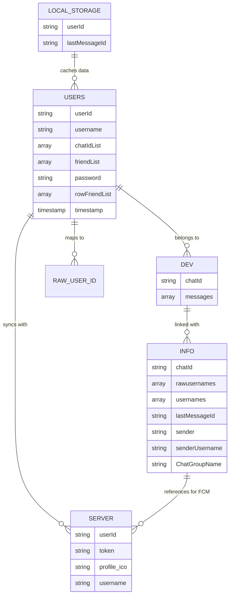
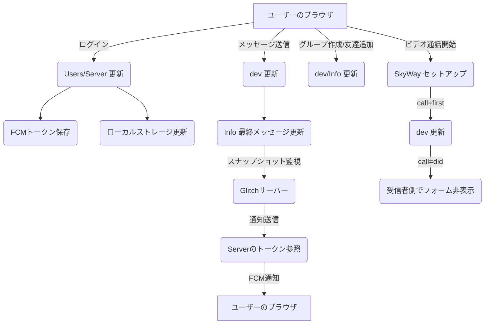
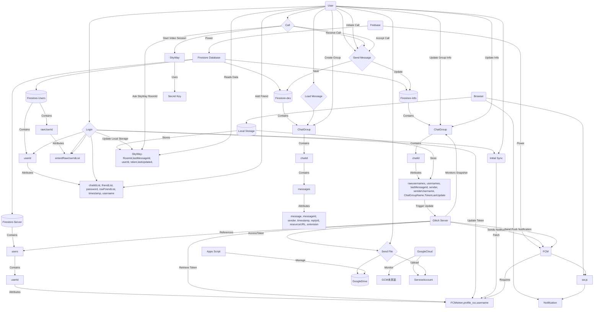
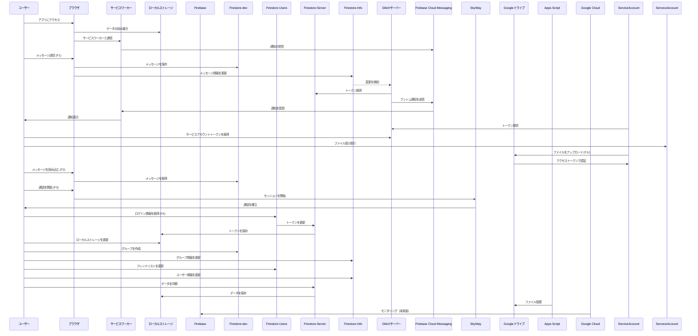
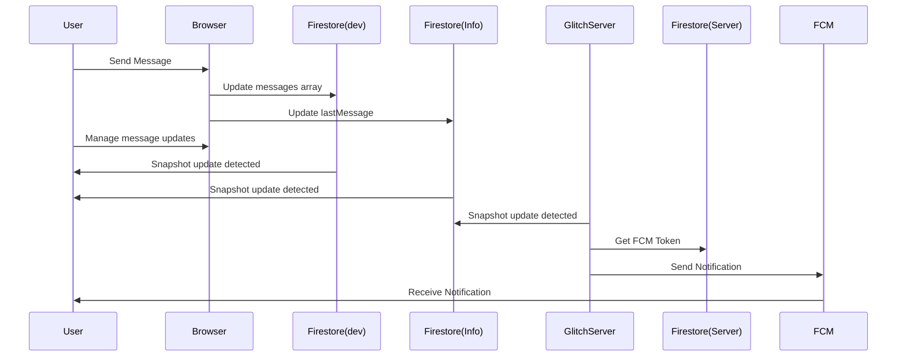

# Ventus-Talk

**開発者**: Roughfts

## 現時点でのVentus-Talkの性能

### 概要
- **4MB** (npm module除く)・静的サイト
- 独自サーバー、静的サイトホスティングでも、独立してサイト設立可能 (ただし、サーバーがない場合はそのサイト間での通知は不可、expressサーバーが動かせるなら可能)
- **3つのFirebaseFirestoreサーバー同時使用**により、請求額とサーバー負荷を軽減 (増設中)

### メッセージ送信性能
- 約**10,000/日**メッセージ送信可能
  - それぞれ単一のメッセージ長は、1〜ブラウザの限界まで (数十万文字。ちなみに容量重い100万文字の中国漢字を送ったらエラーになった)

### メッセージ更新速度
- 平均**0.05秒〜0.15秒**

### その他の特徴
- 通信制限でもアプリさえ開いたら、安定してやり取り可能
- 画像・(動画)・様々なファイル共有可能
- パスワードはハッシュで安全に管理
- ブラウザや、アプリ化様々な媒体で動作可能 (IE非対応)
  - 尚、iPadのブラウザでは通知の権限がないため通知にはアプリ化が必須
- LINEと同じようにアイコン・グループ作成可能 (現在リプライ機能搭載中)
- 友達追加はQRコード又はuserId入力
- 複数アカウント作成可能
- 同期デバイス数制限なし
- Youtubeリンクサイト規制回避自動変換＆埋め込み
- その他リンクサイト規制回避URL自動追加
- **15種類**くらいのフォントと**5種類**のテーマ (テーマの細かいCSSが面倒なので現在やってくれる人募集中)

### セキュリティと制限
- サーバー荒らされる可能性あり
- セキュリティ対策ほぼなし
- 動画送信・閲覧にかなり時間がかかる
- glitchだと、サーバーが起きていないと通知が届かない

## サーバーの説明
| **サーバー名** | **役割** | **詳細** |
| ---------------- | -------- | -------- |
| **dev**          | チャットメッセージの保存と管理 | `ChatGroup - chatId - messages: [message, messageId, sender, timestamp, replyId, resourceURL, extension]` |
| **Users**        | ユーザー情報の保存と管理 | `users - userId - chatIdList, friendList, password, rawFriendList, timestamp, username` `rawUserId - enterdRawUserId: 0: user1, 1: user2, ...` |
| **Server**       | 通知関連情報の管理 | `users - userId - token, profile_ico, username` |
| **Info**         | チャットグループの情報管理 | `ChatGroup - chatId - rawusernames, usernames, rawusernames, lastMessageId, sender, senderUsername, ChatGroupName` |

この真下のフローチャート図は、適当にAIに作らせたので、ちょいと違います。完全に正しいのは、次のGraph TDです。

かなり省略しているので、矢印や処理が足りませんが、おおまかにはこれです。
#Graph TD

＃シーケンズ図

通知の仕組みだけ。

