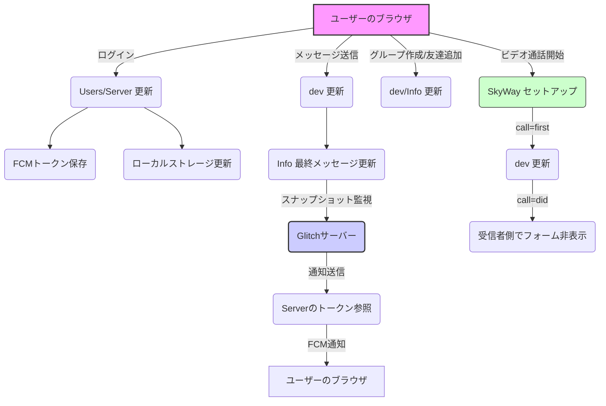

# Ventus-Talk

**開発者**: Roughfts

## 現時点でのVentus-Talkの性能

### 概要
- **4MB** (npm module除く)・静的サイト
- 独自サーバー、静的サイトホスティングでも、独立してサイト設立可能 (ただし、サーバーがない場合はそのサイト間での通知は不可、expressサーバーが動かせるなら可能)
- **3つのFirebaseFirestoreサーバー同時使用**により、請求額とサーバー負荷を軽減 (増設中)

### メッセージ送信性能
- 約**10,000/日**メッセージ送信可能
  - それぞれ単一のメッセージ長は、1〜ブラウザの限界まで (数十万文字。ちなみに容量重い100万文字の中国漢字を送ったらエラーになった)

### メッセージ更新速度
- 平均**0.05秒〜0.15秒**

### その他の特徴
- 通信制限でもアプリさえ開いたら、安定してやり取り可能
- 画像・(動画)・様々なファイル共有可能
- パスワードはハッシュで安全に管理
- ブラウザや、アプリ化様々な媒体で動作可能 (IE非対応)
  - 尚、iPadのブラウザでは通知の権限がないため通知にはアプリ化が必須
- LINEと同じようにアイコン・グループ作成可能 (現在リプライ機能搭載中)
- 友達追加はQRコード又はuserId入力
- 複数アカウント作成可能
- 同期デバイス数制限なし
- Youtubeリンクサイト規制回避自動変換＆埋め込み
- その他リンクサイト規制回避URL自動追加
- **15種類**くらいのフォントと**5種類**のテーマ (テーマの細かいCSSが面倒なので現在やってくれる人募集中)

### セキュリティと制限
- サーバー荒らされる可能性あり
- セキュリティ対策ほぼなし
- 動画送信・閲覧にかなり時間がかかる
- glitchだと、サーバーが起きていないと通知が届かない

## サーバーの説明
| **サーバー名** | **役割** | **詳細** |
| ---------------- | -------- | -------- |
| **dev**          | チャットメッセージの保存と管理 | `ChatGroup - chatId - messages: [message, messageId, sender, timestamp, replyId, resourceURL, extension]` |
| **Users**        | ユーザー情報の保存と管理 | `users - userId - chatIdList, friendList, password, rawFriendList, timestamp, username`<br>`rawUserId - enterdRawUserId: 0: user1, 1: user2, ...` |
| **Server**       | 通知関連情報の管理 | `users - userId - token, profile_ico, username` |
| **Info**         | チャットグループの情報管理 | `ChatGroup - chatId - rawusernames, usernames, rawusernames, lastMessageId, sender, senderUsername, ChatGroupName` |



```mermaid
graph TD

%% Main Components
A[Browser (User)] -->|Login| B(Users DB)
A -->|Login| C(Server DB)
A -->|Login| L(Local Storage)
A -->|Send Message| D(Dev DB)
A -->|Send Message| E(Info DB)
A -->|Create Group / Add Friend| D
A -->|Create Group / Add Friend| E
A -->|Video Call| M(SkyWay - Private Key Hard-coded)

%% Firestore DBs
B -->|Update FCM Token, Chat List, Friend List| C
B --> B1[/users/(userId)/{chatIdList, friendList, password, rowFriendList, timestamp, username}/]
B --> B2[/rawUserId/enterdRawUserId/{rawUserId: 0=user1, 1=user2, ...}/]

C --> C1[/users/(userId)/{token (FCM), profile_ico, username}/]

D --> D1[/ChatGroup/(chatId)/messages[{message, messageId, sender, timestamp, replyId, resourceURL, extension}]/]

E --> E1[/ChatGroup/(chatId)/{rawusernames, usernames, lastMessageId, sender, senderUsername, ChatGroupName}/]

%% Glitch Server Monitoring
F(Glitch Server) -->|Snapshot Monitor| E
F -->|Reference for Notifications| C
F -->|Send Notification| G(FCM - Dev Server)

%% Video Call Flow
A -->|Send Message with call key| D
D -->|Recipient rewrites call key with did| A

%% Local Storage Updates
L -->|Store Last Message ID & Other Data| A

%% Relationships
B -->|Updates| L
C -->|Updates| L
D -->|Updates Last Message| E

```


